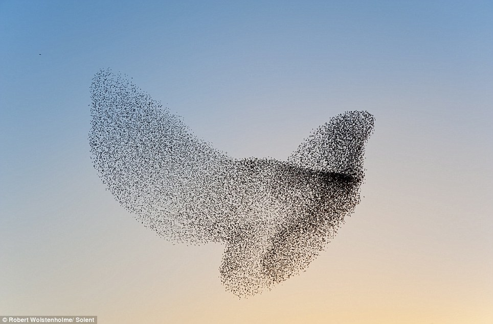
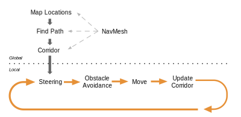
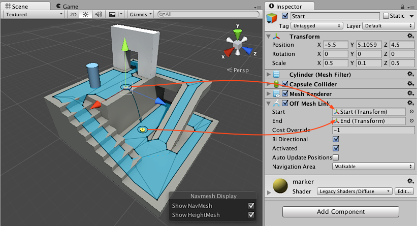
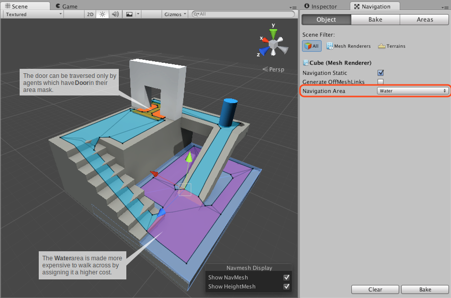
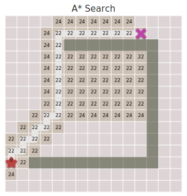
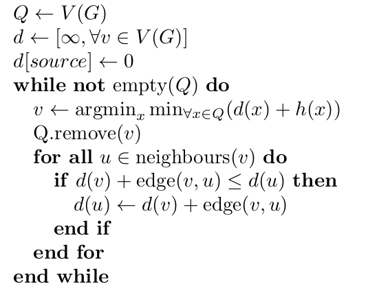

class: center, middle

## Artificial Intelligence

# Movement & <br> Pathfinding in Games

<br>

Gerard Escudero, 2020

<br>



.center[.small[Source: [Birds of a Feather Flock](https://blogs.unimelb.edu.au/sciencecommunication/2014/09/06/birdphysics/)]]

---
class: left, middle, inverse

# Outline

* .cyan[Introduction]

* NavMesh

* Steerings

* Flocking

* Graphs

* Pathfinding

* References

---

# Movement

.center[]
.center[.small[Source: .red[(Millington, 2019)]]]

.blue[It is the lowest AI level.]

---

# Hierarchy of movement behaviors

.center[]
.center[.small[Source: .red[(Reynolds, 1999)]]]

#### Steering

- Composed by .blue[simple atomic behaviors]

- They can be .blue[combined] to behave very complex


---

# Kinematic 


- Simplest behaviors (.blue[static])

- Characters as points (.blue[center of mass])

- .blue[$2\frac{1}{2}D$]: hybrid 2D & 3D to simplify maths

.cols5050[
.col1[
.blue[Input]

- $position$ (vector)

- $orientation$ (float)
]

.col2[
.blue[Output]

- $velocity$ (vector)

- $angular$ (float)

]]

$$position = position + velocity$$

$$orientation = orientation + angle$$

---

# Kinematic Seek & Flee

*It calculates the direction from the agent to the target.*

.cols5050[
.col1[
.blue[Input]: 
- agent(position, orientation)
- target(position)
- maxVelocity, maxRotation

.blue[Output]: 
- velocity
- angle

.blue[Examples]: 
- [Vehicle seek](figures/seek1.mkv)
- [Animal seek](figures/seek2.mkv)
]
.col2[


.small[Source: .red[(Reynolds, 1999)]]
]]

---

# Kinematic in Unity

.blue[direction]: vector from robber to treasure
$$d=(t_x-r_x, 0, t_z-r_z)$$
```C#
// Seek
Vector3 direction = target.transform.position - transform.position;
direction.y = 0f;    // (x, z): position in the floor
// Flee
Vector3 direction = transform.position - target.transform.position;
```

.blue[velocity]: vector direction with magnitude maxVelocity
$$\vert d\vert=\sqrt{d_x^2+d_z^2};v=\frac{d}{\vert d\vert}maxVelocity$$
```C#
Vector3 movement = direction.normalized * maxVelocity;
```

.blue[rotation]:
```C#        
float angle = Mathf.Rad2Deg * Mathf.Atan2(movement.x, movement.z);
Quaternion rotation = Quaternion.AngleAxis(angle, Vector3.up);  // up = y
```

---

# Update and Time in Unity 


.blue[Update]: rotation and position (*dt = Time.deltaTime*)
```C# 
transform.rotation = Quaternion.Slerp(transform.rotation, rotation, 
                                      Time.deltaTime * turnSpeed);
transform.position += transform.forward.normalized * maxVelocity * Time.deltaTime;
```

.blue[Time]: how to reduce frequency in steerings calls
```C# 
    float freq = 0f;
       
    void Update()
    {
        freq += Time.deltaTime;
        if (freq > 0.5)
        {
            freq -= 0.5f;
            Seek(); 
        }
        // Update commands
    }
```

---

# Math & Unity Stuff I

.blue[distance]: between points
$$d(v,w)=\sqrt{(w_x-v_x)^2+(w_z-v_z)^2}$$
```C#
Vector3.Distance(target.transform.position, transform.position)
```
Needed as .blue[stoping criteria] to avoid wiggle in .blue[seek].

.blue[angle]: between 2 vectors

```C#
Mathf.Abs(Vector3.Angle(transform.forward, movement)  // forward = z
```
dot product: $\langle v,w\rangle=v_x\cdot w_x+v_y\cdot w_y$

$$\theta=\arccos{\frac{\langle v,w\rangle}{\vert v\vert \vert w\vert}}$$

---

# Math & Unity Stuff II

.blue[signed angle]: 
```C#
Vector3.SignedAngle(v, w, transform.forward)
```

based on cross product: 

$$v\times w=(v_y\cdot w_z-v_z\cdot w_y,v_z\cdot w_x-v_x\cdot v_z,v_x\cdot w_y-v_y\cdot w_x)$$

.cols5050[
.col1[
- Clockwise: $(v\times w).z<0$

- Anti-clockwise: $(v\times w).z<0$
]
.col2[


.small[Source: .red[[wikipedia](https://en.wikipedia.org/wiki/Cross_product)]]
]]

---

# Steerings

- Kinematic .blue[drawback]: it is not very realistic

- Steering (Dynamic): by adding acceleration

### Seek

.cols5050[
.col1[
.blue[Input]: 
- agent(position, orientation)
- target(position)
- maxVelocity, maxRotation
- acceleration, turnAcceleration

.blue[Output]: 
- velocity
- angle
]
.col2[
.blue[Example]: 
- [Vehicle seek](figures/seek3.mkv)
]]

---

# Steering Update

```C#
void Update()
{
    if (Vector3.Distance(target.transform.position, transform.position) <
        stopDistance) return;

    Seek();   // calls to this function should be reduced

    turnSpeed += turnAcceleration * Time.deltaTime;
    turnSpeed = Mathf.Min(turnSpeed, maxTurnSpeed);
    movSpeed += acceleration * Time.deltaTime;
    movSpeed = Mathf.Min(movSpeed, maxSpeed);

    transform.rotation = Quaternion.Slerp(transform.rotation, 
                                          rotation, Time.deltaTime * turnSpeed);
    transform.position += transform.forward.normalized * movSpeed *
                          Time.deltaTime;   
}
```

---

# Steering Seek 

```C#
void Seek()
{
    Vector3 direction = target.transform.position - transform.position;
    direction.y = 0f;
    movement = direction.normalized * acceleration;
    float angle = Mathf.Rad2Deg * Mathf.Atan2(movement.x, movement.z);
    rotation = Quaternion.AngleAxis(angle, Vector3.up);
}
```

---

# Arriving

*A chasing agent should never reach its goal when seeking.*

- .blue[Stopping distance]

- .blue[Steering Arrive]

$$speed=\frac{maxSpeed\times distance}{slowRadius}$$

.small[.center[max acceleration should be controlled]]

.blue[Example]: 
- [Vehicle seek](figures/seek4.mkv)

---
class: left, middle, inverse

# Outline

* .brown[Introduction]

* .cyan[NavMesh]

* Steerings

* Flocking

* Graphs

* Pathfinding

* References


---

# Recast

- Library [(Mononen, 2016)](https://github.com/recastnavigation/recastnavigation) for pathfinding in 3D games (zlib license).

.center[]

- Used by all major engines (state of the art)

- Also some proprietary engine ([Horizon Zero Dawn](https://www.guerrilla-games.com/play/horizon))

---

# Navigation Mesh

.center[]
.center[Recast in Unity ([documentation & source](https://docs.unity3d.com/Manual/nav-NavigationSystem.html))]

.cols5050[
.col1[
.blue[NavMesh]: polygon set representing walkable surfaces

.blue[NavMeshAgent]: navigation component
]
.col2[
.blue[OffMeshLink]: navigation shortcuts

.blue[NavMeshObstacle]: dynamic obstacle
]]

---

# NavMesh

.cols5050[
.col1[
.blue[Creating the NavMesh]:

- Open `Window - AI - Navigation`

- Select scene objectes as:
  - `Static`
  - `Walkable` or `Not Walkable`

- Click `Bake` tab - `Bake` button

Bake again as you need

[Main properties](https://docs.unity3d.com/Manual/nav-BuildingNavMesh.html):

- *Agent Radius & Height*

- *Max Slope & Step Height*
]
.col2[


]]

---

# NavMesh Agent I

[Inner Workings of the Navigation System](https://docs.unity3d.com/Manual/nav-InnerWorkings.html):

1. Find Paths
2. Follow the Path
3. Avoid Obstacles
4. Move the Agent (Steerings)

.center[]

---

# NavMesh Agent II

.blue[Using the NavMesh]:

- Add the `NavMesh Agent` component to the agent

- Code:

```
    public NavMeshAgent agent;
    public GameObject target;

    void Seek()
    {
        agent.destination = target.transform.position; 
    };
```

[Main property groups](https://docs.unity3d.com/Manual/class-NavMeshAgent.html):

- **Steering**: *Speed*, *Stopping Distance*, *Auto Braking*...

- **Object Avoidance**: *Radius*...

- **Path Finding**: *Auto Traverse Off Mesh Links*...

---

# NavMesh Obstacle

.blue[Creating a dynamic obstable]:

- Add the `NavMesh Obstacle` component to the object

- Add the `RigidBody` component to the object (being `kinematic`)

[Main property](https://docs.unity3d.com/Manual/class-NavMeshObstacle.html):

- *Carve*: creates a hole in the NavMesh


.center[.small[[Source & documentation](https://docs.unity3d.com/Manual/class-NavMeshObstacle.html)]]

---

# Off-Mesh Link I

.blue[Creating an Off-mesh Link]:

- Add the `Off Mesh Link` component to one of the two objects

.center[]
.center[.small[[Source & documentation](https://docs.unity3d.com/Manual/nav-CreateOffMeshLink.html)]]

---

# Off-Mesh Link II

.blue[Building Off-mesh Links]:

- Tic the `Generate OffMeshLinks` at `Navigation - Object`

.center[]
.center[.small[[Source & documentation](https://docs.unity3d.com/Manual/nav-BuildingOffMeshLinksAutomatically.html)]]

- `Bake` again

[Main properties](https://docs.unity3d.com/Manual/nav-BuildingOffMeshLinksAutomatically.html):

- *Drop Height* & *Jump Distance*

---

# Navigation Areas and Costs

.blue[Navigation Areas] define how difficult it is to walk across a specific area.

.center[]
.center[.small[[Source & documentation](https://docs.unity3d.com/Manual/nav-AreasAndCosts.html)]]


---

# Navigation System

### A* searh algorithm

- `NavMeshAgent.SetDestination`: possible not available at next frame

- `NavMeshAgent.pathPending`

### NavMeshPath

- Data structure: path as a list of waypoints

- `NavMeshAgent.path`: [documentation](https://docs.unity3d.com/ScriptReference/AI.NavMeshPath.html)

### Advanced NavMesh

- [Mesh Polygons](https://docs.unity3d.com/ScriptReference/AI.NavMeshTriangulation.html)

- [NavMesh building components](https://docs.unity3d.com/Manual/NavMesh-BuildingComponents.html)

---
class: left, middle, inverse

# Outline

* .brown[Introduction]

* .brown[NavMesh]

* .cyan[Steerings]

* Combination (flocking)

* Pathfinding

* References

---

# Wander

.cols5050[
.col1[

.blue[Simple implementation]:
.small[
```
void Wander()
{
    float radius = 2f;
    float offset = 3f;

    Vector3 localTarget = new Vector3(
        Random.Range(-1.0f, 1.0f), 0, 
        Random.Range(-1.0f, 1.0f));
    localTarget.Normalize();
    localTarget *= radius;
    localTarget += new Vector3(0, 0, offset);

    Vector3 worldTarget = 
        transform.TransformPoint(localTarget);
    worldTarget.y = 0f;

    Seek(worldTarget);
}
```

[Example](figures/wander.mkv)
]
]
.col2[

.center[.small[.red[(Millington, 2019)]]]

.blue[Issues]:
- How often calling wander?
- What happens in the limit? 
- Remember *Auto Brake* & *Stopping Distance*
]]

---

# Pursue & Evade

.blue[Simple implementation]:

```
Vector3 targetDir = target.transform.position - transform.position;
float lookAhead = targetDir.magnitude / agent.speed;
Seek(target.transform.position + target.transform.forward * lookAhead);

// Flee for evasion
```

.cols5050[
.col1[
.blue[Examples]: 

- [pursuit](figures/pursuit.mkv)

- [evasion](figures/evasion.mkv)
]
.col2[
.center[]
.center[.small[[Source](http://www.red3d.com/cwr/steer/gdc99/)]]
]]
---

# Hide (Previous C# Stuff)

[Example](figures/hide.mkv)

.blue[Defining Hiding Spots]:

```
GameObject[] hidingSpots;
...
hidingSpots = GameObject.FindGameObjectsWithTag("hide");
```

.cols5050[
.col1[
.blue[Anonymous Functions]:

`Func<int, int> inc = (a) => a + 1;`

`inc(4))`  👉  5

.blue[Tuples]:
```
(int, string) a = (1, "Pep");
(int, string) b = (2, "Anna");
```
`a.CompareTo(b)`  👉  -1

]
.col2[
.blue[Linq Select] (Queries):

`int[] v = { 3, 2, -3, 5 };`

`v.Min()`  👉  -3

`v.Select((x) => Math.Abs(x)).Min()`  👉  2
]]

---

# Hide

.blue[Simple implementation]:

```
    void Hide()
    {
        Func<GameObject, float> distance = 
            (hs) => Vector3.Distance(target.transform.position, 
                                     hs.transform.position);
        GameObject hidingSpot = hidingSpots.Select(
            ho => (distance(ho), ho)
            ).Min().Item2;

        Vector3 dir = hidingSpot.transform.position - target.transform.position;
        Ray backRay = new Ray(hidingSpot.transform.position, -dir.normalized);
        RaycastHit info;
        hidingSpot.GetComponent<Collider>().Raycast(backRay, out info, 50f);   

        Seek(info.point + dir.normalized);     
    }
```

---

# Follow Path

.blue[Patrol with Waypoints]:

```
public GameObject[] waypoints;
int patrolWP = 0;
...
if (!agent.pathPending && agent.remainingDistance < 0.5f) Patrol();
...
void Patrol()
{
    patrolWP = (patrolWP + 1) % waypoints.Length;
    Seek(waypoints[patrolWP].transform.position);
}
```
- [Example](figures/patrol1.mkv)

- [Reference](https://docs.unity3d.com/Manual/nav-AgentPatrol.html)

---

# Smoothing the corners

.blue[Ghost Following]:

- Follow a ghost agent <br>
[Example](figures/patrol2.mkv)

- Adjust speeds (ghost waiting?)

- Remember to disable the ghost `Mesh Renderer`

.cols5050[
.col1[
.blue[Path Following]:

Use .blue[Beizer Curves] to create the path. <br>

- [BG Curve](https://assetstore.unity.com/packages/tools/utilities/bg-curve-59043) asset. BansheeGz, 2020.
- [Bézier Path Creator](https://assetstore.unity.com/packages/tools/utilities/b-zier-path-creator-136082) asset. Sebastian Lague, 2019.

Both contain getting closest point to the curve.

]
.col2[

]]

---

# Combining Steering Behaviors

- Previours steerings serve as building blocks for complex behaviors.

- Combination can happen in many ways:
  - .blue[Arbitration]: switch steerings as world changes<br>
Example: *wander* & *pursue*

  - .blue[Blending]: sum or weighted sum<br>
Example: flocking (*separation* + *align* + *cohesion*)<br>
Problem: .red[components cancelling]

  - .blue[Mixing arbitration and blending]

- Advanced combinations:
  - .blue[Priority groups]: blending plus priorities<br>
execute highest priority steerings and ignore the rest

  - .blue[More complex structures]: *Cooperative Arbitration* 

- Combinations need to be carefully adjusted.

---

# Steering Stuff

- There are many more movements (see references): <br>
Example: .blue[Obstacle and Wall Avoidance]

.center[]
.center[.small[[Source](http://www.red3d.com/cwr/steer/gdc99/)]]

- [Reynolds OpenSteer](http://opensteer.sourceforge.net/) <br>
C++ library to help construct steering behaviors for autonomous characters in games and animation

---
class: left, middle, inverse

# Outline

* .brown[Introduction]

* .brown[NavMesh]

* .brown[Steerings]

* .cyan[Flocking]

* Graphs

* Pathfinding

* References


---

# Flocking

.cols5050[
.col1[
*Groupal behavior such of birds or fishes.* 

.blue[Sum of three simple rules]:

- **Cohesion**: neighbour center of mass
- **Match velocity/align**: average neighbours heading
- **Separation**: avoid crowding neighbours 
]
.col2[

.small[Source: [Birds of a Feather Flock](https://blogs.unimelb.edu.au/sciencecommunication/2014/09/06/birdphysics/)]

[Example Video](figures/flocking.mkv)
]]

.center[

<br>
[source](http://www.red3d.com/cwr/steer/gdc99/)]

---

# Flocking Settings

.blue[Flocking Manager]:

.center[]

```
allFish = new GameObject[numFish];
for (int i = 0; i < numFish; ++i) {
    Vector3 pos = this.transform.position + ... // random position
    Vector3 randomize = ... // random vector direction
    allFish[i] = (GameObject)Instantiate(fishPrefab, pos, 
                                Quaternion.LookRotation(randomize));
    allFish[i].GetComponent<Flock>().myManager = this;
}
```

---

# Flocking Rules I

.blue[Cohesion]:

```
Vector3 cohesion = Vector3.zero;
int num = 0;

foreach (GameObject go in myManager.allFish) {
    if (go != this.gameObject) {
        float distance = Vector3.Distance(go.transform.position, 
                                          transform.position);
        if (distance <= myManager.neighbourDistance) {
            cohesion += go.transform.position;
            num++;
        }
    }
}

if (num > 0)
    cohesion = (cohesion / num - transform.position).normalized * speed;
```

---

# Flocking Rules II

.blue[Match velocity/align]:

```
Vector3 align = Vector3.zero;
int num = 0;

foreach (GameObject go in myManager.allFish) {
    if (go != this.gameObject) {
        float distance = Vector3.Distance(go.transform.position, 
                                          transform.position);
        if (distance <= myManager.neighbourDistance) {
            align += go.GetComponent<Flock>().direction;
            num++;
        }
    }
}

if (num > 0) {
    align /= num;
    speed = Mathf.Clamp(align.magnitude, myManager.minSpeed, myManager.maxSpeed);
}
```

---

# Flocking Rules III

.blue[Separation]:

```
Vector3 separation = Vector3.zero;

foreach (GameObject go in myManager.allFish) {
    if (go != this.gameObject) {
        float distance = Vector3.Distance(go.transform.position, 
                                          transform.position);
        if (distance <= myManager.neighbourDistance)
            separation -= (transform.position - go.transform.position) / 
                          (distance * distance);
    }
}
```

---

# More Flocking Stuff

.blue[Combination]:

```
direction = (cohesion + align + separation).normalized * speed;
```
- Three rules + combination should be placed in the same `foreach`.

.blue[Update]:

```
transform.rotation = Quaternion.Slerp(transform.rotation,
                                      Quaternion.LookRotation(direction),
                                      myManager.rotationSpeed * Time.deltaTime);
transform.Translate(0.0f, 0.0f, Time.deltaTime * speed);
```

.blue[Final notes]:

- Rules should not be calculated every frame.

- Some random issues enriches the behaviour.

- Introduction of a lider is a common extension.

<!--
Notes:
- Comentar que juguin amb els paràmetres.
- Referència a la implementació de Sebastian Lague
-->

---
class: left, middle, inverse

# Outline

* .brown[Introduction]

* .brown[NavMesh]

* .brown[Steerings]

* .brown[Flocking]

* .cyan[Graphs]

* Pathfinding

* References

---

# Graphs

.cols5050[
.col1[
.red[*]

.red[*]
]
.col2[
.blue[Math definition]:

$G=(V,E)$

$V=\textrm{set of vertices}$

$E=\textrm{set of edges}$

.blue[Example]:

$V=${$v_1,v_2,v_3$}

$E=${$(v_1,v_2),(v_1,v_3),(v_2,v_3)$}

]]

- .blue[Edges] can be .blue[directed] (one way) or .blue[undirected] (two ways).

- Both vertices and edges can contain information.

.footnote[.red[*] [Source](https://medium.com/basecs/a-gentle-introduction-to-graph-theory-77969829ead8)]

---

# Representation as graphs

.center[

<br>
.red[[source](https://www.redblobgames.com/pathfinding/a-star/introduction.html)]]

.cols5050[
.col1[
.center[<br>
.red[[Source](https://docs.aws.amazon.com/neptune/latest/userguide/graph-database.html)]]
]
.col2[
.center[<br>
.red[[Source](https://quantdare.com/graph-theory-finance/)]]
]]

---

# Some Applications in GameAI

.cols5050[
.col1[
.blue[Pathfinding]:

.center[<br>
.red[[Source](https://theory.stanford.edu/~amitp/GameProgramming/MapRepresentations.html)]]

.blue[Decision making]: planners

.center[<br>
.red[[Source](https://www.indiedb.com/games/attack-of-the-gelatinous-blob/news/a-look-into-the-ai-goap)]]
]
.col2[

.blue[Tactics]: influence maps

.center[<br>
.red[[Source](https://www.gamedev.net/articles/programming/artificial-intelligence/the-total-beginners-guide-to-game-ai-r4942/)]]
]]

---

# Shortest Path Problem

.cols5050[
.col1[
*Find the minimum (sum of edges costs) path between two vertices.*

Main Algorithms:
- .blue[Dijkstra]: general cases
- .blue[A*]: requires an heuristic $h$ (estimation cost function)
]
.col2[
.center[
<br>
[Source](https://en.wikipedia.org/wiki/Shortest_path_problem)]
]]

.center[

<br>
[Source](https://www.redblobgames.com/pathfinding/a-star/introduction.html)]

---

# Dijkstra

.cols5050[
.col1[
.blue[Pseudocode]:

[Source](http://db.cs.duke.edu/courses/fall11/cps149s/notes/a_star.pdf)

.blue[C# implementation]: [view](code/shortestPath.html) / [code](shortestPath.cs)
]
.col2[
.center[

[Source](https://en.wikipedia.org/wiki/Dijkstra%27s_algorithm)]
]]

---

# A*

.cols5050[
.col1[
.blue[Pseudocode]:

[Source](http://db.cs.duke.edu/courses/fall11/cps149s/notes/a_star.pdf)

.blue[C# implementation]: [view](code/shortestPath.html) / [code](shortestPath.cs)
]
.col2[
.center[

[Source](https://en.wikipedia.org/wiki/A*_search_algorithm)]
]]

---
class: left, middle, inverse

# Outline

* .brown[Introduction]

* .brown[NavMesh]

* .brown[Steerings]

* .brown[Flocking]

* .brown[Graphs]

* .cyan[Pathfinding]

* References

---

# Pathfinding

Aplicació A* per pathfinding:

- polygons

- A*

- suavitzat de camins

---

# Advanced Pathfinding

- Hierarchical Pathfinding

- Open Goal Pathfinding

- Dynamic Pathfinding

- IDA / SMA

- Time Slicing and Pooling Planners

---

# Hierarchical Pathfinding

.cols5050[
.col1[
- How would be speed up this example ?

- More than 2 ms is bad for Real Time applications

- [Code](https://github.com/anvaka/ngraph.path) and [Demo](https://anvaka.github.io/ngraph.path.demo/#?graph=amsterdam-roads) here
]
.col2[

]]

---
class: left, middle, inverse

# Outline

* .brown[Introduction]

* .brown[NavMesh]

* .brown[Steerings]

* .brown[Flocking]

* .brown[Graphs]

* .brown[Pathfinding]

* .cyan[References]

---

# References

- Ian Millington. *AI for Games* (3rd ed). CRC Press, 2019.

- Craig W. Reynolds. [Steering Behaviors For autonomous Characters](http://www.red3d.com/cwr/papers/1999/gdc99steer.pdf). Proceedings of the Game Developers Conference (GDC), 1999.

- Penny de Byl. [Artificial Intelligence for Beginners](https://learn.unity.com/course/artificial-intelligence-for-beginners). Unity Learn Course, 2020.

- Sebastian Lague. [Boids (Flocking, github)](https://github.com/SebLague/Boids). [Video](https://www.youtube.com/watch?v=bqtqltqcQhw), 2019.

## Libraries

- Craig W. Reynolds. [OpenSteer](http://opensteer.sourceforge.net/), 2004.

- Mikko Mononen. [Recast & Detour](https://github.com/recastnavigation/recastnavigation), 2016.

---

# Resources

.blue[Examples]:

- [Easy Primitive People](https://assetstore.unity.com/packages/3d/characters/easy-primitive-people-161846) asset. Bit Gamey, 2020.

- [LowPoly Trees and Rocks](https://assetstore.unity.com/packages/3d/vegetation/lowpoly-trees-and-rocks-88376) asset. greyRoad Studio, 2019.

- [Five Seamless Tileable Ground Textures](https://assetstore.unity.com/packages/2d/textures-materials/floors/five-seamless-tileable-ground-textures-57060) asset. A3D, 2020.

- [Simplistic Low Poly Nature](https://assetstore.unity.com/packages/3d/environments/simplistic-low-poly-nature-93894) asset. Acorn Bringer, 2018.

.blue[Bezier Curves]:

- [BG Curve](https://assetstore.unity.com/packages/tools/utilities/bg-curve-59043) asset. BansheeGz, 2020.

- [Bézier Path Creator](https://assetstore.unity.com/packages/tools/utilities/b-zier-path-creator-136082) asset. Sebastian Lague, 2019.

.blue[Image]

- [Fondo Marino](https://commons.wikimedia.org/wiki/File:Fondo_marino_3.jpg). Alejandro Muñoz Cabrisas, 2017.

