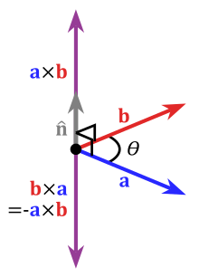

class: center, middle

## Artificial Intelligence

# Movement in Games

<br>

Gerard Escudero, 2020

<br>


.center[.small[Source: [Birds of a Feather Flock](https://blogs.unimelb.edu.au/sciencecommunication/2014/09/06/birdphysics/)]]

---
class: left, middle, inverse

# Outline

* .cyan[Introduction]

* Recast & NavMesh

* Steerings

* Combination (flocking)

* Pathfinding

* References

---

# Movement

.center[]
.center[.small[Source: .red[(Millington, 2019)]]]

.blue[It is the lowest AI level.]

---

# Hierarchy of movement behaviors

.center[]
.center[.small[Source: .red[(Reynolds, 1999)]]]

#### Steering

- Composed by .blue[simple atomic behaviors]

- They can be .blue[combined] to behave very complex


---

# Kinematic 


- Simplest behaviors (.blue[static])

- Characters as points (.blue[center of mass])

- .blue[$2\frac{1}{2}D$]: hybrid 2D & 3D to simplify maths

.cols5050[
.col1[
.blue[Input]

- $position$ (vector)

- $orientation$ (float)
]

.col2[
.blue[Output]

- $velocity$ (vector)

- $angular$ (float)

]]

$$position = position + velocity$$

$$orientation = orientation + angle$$

---

# Kinematic Seek & Flee

*It calculates the direction from the agent to the target.*

.cols5050[
.col1[
.blue[Input]: 
- agent(position, orientation)
- target(position)
- maxVelocity, maxRotation

.blue[Output]: 
- velocity
- angle

.blue[Examples]: 
- [Vehicle seek](figures/seek1.mkv)
- [Animal seek](figures/seek2.mkv)
]
.col2[


.small[Source: .red[(Reynolds, 1999)]]
]]

---

# Kinematic in Unity

.blue[direction]: vector from robber to treasure
$$d=(t_x-r_x, 0, t_z-r_z)$$
```C#
// Seek
Vector3 direction = target.transform.position - transform.position;
direction.y = 0f;    // (x, z): position in the floor
// Flee
Vector3 direction = transform.position - target.transform.position;
```

.blue[velocity]: vector direction with magnitude maxVelocity
$$\vert d\vert=\sqrt{d_x^2+d_z^2};v=\frac{d}{\vert d\vert}maxVelocity$$
```C#
Vector3 movement = direction.normalized * maxVelocity;
```

.blue[rotation]:
```C#        
float angle = Mathf.Rad2Deg * Mathf.Atan2(movement.x, movement.z);
Quaternion rotation = Quaternion.AngleAxis(angle, Vector3.up);  // up = y
```

---

# Update and Time in Unity 


.blue[Update]: rotation and position (*dt = Time.deltaTime*)
```C# 
transform.rotation = Quaternion.Slerp(transform.rotation, rotation, 
                                      Time.deltaTime * turnSpeed);
transform.position += transform.forward.normalized * maxVelocity * Time.deltaTime;
```

.blue[Time]: how to reduce frequency in steerings calls
```C# 
    float freq = 0f;
       
    void Update()
    {
        freq += Time.deltaTime;
        if (freq > 0.5)
        {
            freq -= 0.5f;
            Seek(); 
        }
        // Update commands
    }
```

---

# Math & Unity Stuff I

.blue[distance]: between points
$$d(v,w)=\sqrt{(w_x-v_x)^2+(w_z-v_z)^2}$$
```C#
Vector3.Distance(target.transform.position, transform.position)
```
Needed as .blue[stoping criteria] to avoid wiggle in .blue[seek].

.blue[angle]: between 2 vectors

```C#
Mathf.Abs(Vector3.Angle(transform.forward, movement)  // forward = z
```
dot product: $\langle v,w\rangle=v_x\cdot w_x+v_y\cdot w_y$

$$\theta=\arccos{\frac{\langle v,w\rangle}{\vert v\vert \vert w\vert}}$$

---

# Math & Unity Stuff II

.blue[signed angle]: 
```C#
Vector3.SignedAngle(v, w, transform.forward)
```

based on cross product: 

$$v\times w=(v_y\cdot w_z-v_z\cdot w_y,v_z\cdot w_x-v_x\cdot v_z,v_x\cdot w_y-v_y\cdot w_x)$$

.cols5050[
.col1[
- Clockwise: $(v\times w).z<0$

- Anti-clockwise: $(v\times w).z<0$
]
.col2[


.small[Source: .red[[wikipedia](https://en.wikipedia.org/wiki/Cross_product)]]
]]

---

# Steerings

- Kinematic .blue[drawback]: it is not very realistic

- Steering (Dynamic): by adding acceleration

### Seek

.cols5050[
.col1[
.blue[Input]: 
- agent(position, orientation)
- target(position)
- maxVelocity, maxRotation
- acceleration, turnAcceleration

.blue[Output]: 
- velocity
- angle
]
.col2[
.blue[Example]: 
- [Vehicle seek](figures/seek3.mkv)
]]
---

# Steering Seek

```C#
void Update()
{
    if (Vector3.Distance(target.transform.position, transform.position) <
        stopDistance) return;

    Seek();   // calls to this function should be reduced

    turnSpeed += turnAcceleration * Time.deltaTime;
    turnSpeed = Mathf.Min(turnSpeed, maxTurnSpeed);
    movSpeed += acceleration * Time.deltaTime;
    movSpeed = Mathf.Min(movSpeed, maxSpeed);

    transform.rotation = Quaternion.Slerp(transform.rotation, 
                                          rotation, Time.deltaTime * turnSpeed);
    transform.position += transform.forward.normalized * movSpeed *
                          Time.deltaTime;   
}

void Seek()
{
    Vector3 direction = target.transform.position - transform.position;
    direction.y = 0f;
    movement = direction.normalized * acceleration;
    float angle = Mathf.Rad2Deg * Mathf.Atan2(movement.x, movement.z);
    rotation = Quaternion.AngleAxis(angle, Vector3.up);
}
```

---

# Arriving

*A chasing agent should never reach its goal when seeking.*

- .blue[Stopping distance]

- Steering Arrive

speed=\frac{maxSpeed\times}{slowRadius}

  - distance / slowRadius

  - max acceleration should be controlled


---
class: left, middle, inverse

# Outline

* .brown[Introduction]

* .cyan[Recast]

* Steerings

* Combination (flocking)

* Pathfinding

---

# Recast

- Library [(Mononen, 2016)](https://github.com/recastnavigation/recastnavigation) for pathfinding in 3D games (zlib license).

.center[]

- Used by all major engines (state of the art)

- Also some proprietary engine ([Horizon Zero Dawn](https://www.guerrilla-games.com/play/horizon))

---

# Navigation Mesh

.center[]
.center[Recast in Unity ([documentation & source](https://docs.unity3d.com/Manual/nav-NavigationSystem.html))]

.cols5050[
.col1[
.blue[NavMesh]: polygon set representing walkable surfaces

.blue[NavMeshAgent]: navigation component
]
.col2[
.blue[OffMeshLink]: navigation shortcuts

.blue[NavMeshObstacle]: dynamic obstacle
]]

---

# NavMesh

transpes i documentation

---

# NavMeshAgent

---

# NavMeshObstacle

---

# OffMeshLink


---

# New Areas


---

# NavMeshPath

[documentation](https://docs.unity3d.com/ScriptReference/AI.NavMeshPath.html)

---
class: left, middle, inverse

# Outline

* .brown[Introduction]

* .brown[Recast]

* .cyan[Steerings]

* Pathfinding

---

# Steerings

Mapa de delegates

### Quins?
- Seek & Flee: Wander, Pursue & Evade, Hide
- Velocity Matching: Arrive (amb el seek)

### Combining: flocking
- Separation
- Cohesion
- Match velocity/align

---

### Pathfinding
- Recast
- A*, dijkstra...


### ???
- Avançar el Recast abans dels steerings avançats

---

# References

- Ian Millington. *AI for Games* (3rd ed). CRC Press, 2019.

- C. W. Reynolds. [Steering Behaviors For autonomous Characters](http://www.red3d.com/cwr/papers/1999/gdc99steer.pdf). Proceedings of the Game Developers Conference (GDC), 1999.

## Libraries

- Craig W. Reynolds. [OpenSteer](http://opensteer.sourceforge.net/), 2004.

- Mikko Mononen. [Recast & Detour](https://github.com/recastnavigation/recastnavigation), 2016.

## Resources

- [Easy Primitive People](https://assetstore.unity.com/packages/3d/characters/easy-primitive-people-161846) asset. Bit Gamey, 2020.

- [LowPoly Trees and Rocks](https://assetstore.unity.com/packages/3d/vegetation/lowpoly-trees-and-rocks-88376) asset. greyRoad Studio, 2019.

- [Five Seamless Tileable Ground Textures](https://assetstore.unity.com/packages/2d/textures-materials/floors/five-seamless-tileable-ground-textures-57060) asset. A3D, 2020.
